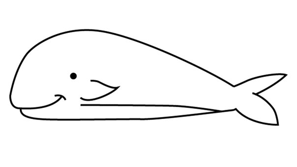

# Basics

Инкапсуляция, Полиморфизм, Абстракция, Наследование. Попытаюсь в этой краткой статье раскрыть что стоит за этими понятиями. 

### Абстракция

Абстракция - это отвлеченное понятие о предмете из реальной жизни. Абстрагируясь человек заоостряет внимание на важных чертах предмета. Почему это понятие входит в концепцию ООП? Дело, в том, что все классы являются абстракцией. Они не являются полной копией предмета, а лишь представляют из себя некоторое краткое описание его свойств и поведения. 

 

