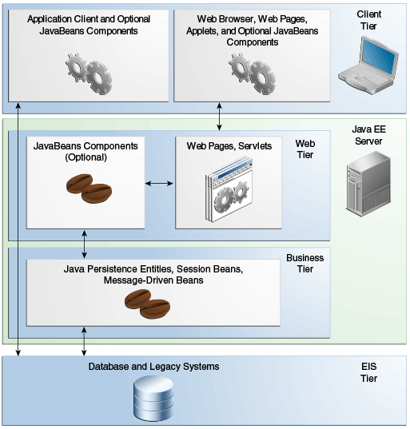

# Distributed Multitiered Applications

Платформа Java EE использует распределенную многоуровневую модель приложения для корпоративных приложений. Логика приложения делится на компоненты в соответствии с функцией, а компоненты приложения, составляющие приложение Java EE, устанавливаются на различных машинах в зависимости от уровня в многоуровневой среде Java EE, к которой принадлежит компонент приложения.

На рис. 1-1 показаны два многоуровневых приложения Java EE, разделенных на уровни, описанные в следующем списке. Части приложения Java EE, показанные на рис. 1-1, представлены в компонентах Java EE.

* Компоненты клиентского уровня выполняются на клиентском компьютере.
* Компоненты веб-уровня выполняются на сервере Java EE.
* Компоненты бизнес-уровня выполняются на сервере Java EE.
* Enterprise information system \(EIS\)-программное обеспечение уровня EIS работает на сервере EIS.

Хотя приложение Java EE может состоять из всех уровней, показанных на рис. 1-1, многоуровневые приложения Java EE обычно считаются трехуровневыми приложениями, поскольку они распределены по трем местоположениям:клиентским машинам, машине сервера Java EE и базе данных или устаревшим\(legacy\) машинам в back end. Трехуровневые приложения, работающие таким образом, расширяют стандартную двухуровневую модель клиент-сервер, помещая многопоточный сервер приложений между клиентским приложением и серверным хранилищем.

#### Безопасность

Хотя другие модели корпоративных приложений требуют принятия в каждом приложении специфичных для платформы мер безопасности, среда безопасности Java EE позволяет определять ограничения безопасности во время развертывания. Платформа Java EE делает приложения портативными для широкого спектра реализаций безопасности, защищая разработчиков приложений от сложности реализации функций безопасности.

Платформа Java EE предоставляет стандартные декларативные правила управления доступом, которые определяются разработчиком и интерпретируются при развертывании приложения на сервере. Java EE также предоставляет стандартные механизмы входа, чтобы разработчикам приложений не приходилось реализовывать эти механизмы в своих приложениях. Одно и то же приложение работает в различных средах безопасности без изменения исходного кода.

#### Java EE Компоненты 

Приложения Java EE состоят из компонентов. Компонент Java EE-это автономный функциональный программный блок, который собирается в приложение Java EE со связанными классами и файлами и взаимодействует с другими компонентами.

Спецификация Java EE определяет следующие компоненты Java EE:

* Клиентские приложения и компоненты апплеты, которые выполняются на клиенте.
* Компоненты технологий Java Servlet, JavaServer Faces, JavaServer Pages - веб-компоненты, работающие на сервере.
* Компоненты EJB\( Корпоративные компоненты\) - бизнес-компоненты, работающие на сервере.

Компоненты Java EE написаны на языке программирования Java и компилируются так же, как и любая программа на этом языке. Различия между компонентами Java EE и "стандартными" классами Java заключаются в том, что компоненты Java EE собираются в приложение Java EE, которое проверется на правильность и соответствие спецификации Java EE, и они развертываются в продакшн, где они запускаются и управляются сервером Java EE.

### Клиенты Java EE

Клиент Java EE обычно является либо веб-клиентом, либо клиентом приложения.

#### Веб-клиент

Веб-клиент состоит из двух частей:

* Динамические веб-страницы, содержащие различные типы языка разметки \(HTML, XML, ...\)
* Веб-браузер, которые отображает страницы, полученные с сервера

Веб-клиент иногда называют тонким клиентом. Тонкие клиенты обычно не запрашивают базы данных, не выполняют сложные бизнес-правила и не подключаются к legacy-приложениям. При использовании тонкого клиента такие тяжеловесные операции выгружаются в корпоративные компоненты, выполняемые на сервере Java EE, где они могут использовать безопасность, скорость, службы и надежность серверных технологий Java EE.

#### Приложение клиента

Приложение клиента работает на клиентском компьютере и предоставляет пользователям возможность обрабатывать задачи, требующие более богатого пользовательского интерфейса, чем язык разметки. Приложение клиент обычно имеет графический пользовательский интерфейс \(GUI\), созданный из API Swing или API Abstract Window Toolkit \(AWT\), но интерфейс командной строки, безусловно, возможен.

Приложения клиент напрямую обращаются к корпоративным компонентам, работающим на бизнес-уровне. Однако, если этого требуют требования приложения, приложение клиента может открыть HTTP-соединение для установления связи с сервлетом, запущенным на веб-уровне. Приложения клиента, написанные на языках, отличных от Java, могут взаимодействовать с серверами Java EE, позволяя платформе Java EE взаимодействовать с устаревшими системами, клиентами и не-Java языками.

#### Апплеты

Веб-страница, полученная с веб-уровня, может включать встроенный апплет. Написана на языке программирования Java, апплет-это небольшое клиентское приложение, которое выполняется в виртуальной машине Java, установленной в веб-браузере. Однако клиентским системам, скорее всего, потребуется плагин Java и, возможно, файл политики безопасности для успешного выполнения апплета в веб-браузере.

Веб-компоненты являются предпочтительным API для создания веб-клиентской программы, поскольку в клиентских системах не требуются плагины или файлы политики безопасности. Кроме того, веб-компоненты обеспечивают более чистый и модульный дизайн приложений, поскольку они позволяют отделить Программирование приложений от дизайна веб-страниц. Таким образом, персоналу, участвующему в разработке веб-страниц, не нужно понимать синтаксис языка программирования Java для выполнения своей работы.

### Архитектура Компонентов JavaBeans

Уровни сервера и клиента могут также включать компоненты на основе архитектуры компонентов JavaBeans \(компоненты JavaBeans\) для управления потоком данных между следующими:

* Клиентское приложение или апплет или приложение работающее на сервере Java EE
* Серверные компоненты и баз данных

Компоненты JavaBeans не считаются компонентами Java EE спецификацией Java EE.

Компоненты JavaBeans имеют свойства и имеют методы get и set для доступа к этим свойствам. Компоненты JavaBeans, используемые таким образом, обычно просты в дизайне и реализации, но должны соответствовать соглашениям об именах и дизайне, изложенным в архитектуре компонентов JavaBeans.

### Связь с сервером Java EE

На Рис. 1-2 показаны различные элементы, которые могут составлять клиентский уровень. Клиент взаимодействует с бизнес-уровнем, запущенным на сервере Java EE, напрямую или, как в случае клиента, запущенного в браузере, просматривая веб-страницы или сервлеты, запущенные на веб-уровне.

### Web-компоненты

Веб-компоненты Java EE-это сервлеты или веб-страницы, созданные с использованием технологии JavaServer Faces и/или технологии JSP \(JSP pages\). Сервлеты-это классы языка программирования Java, которые динамически обрабатывают запросы и конструируют ответы. Страницы JSP-это текстовые документы, которые выполняются как сервлеты, но позволяют использовать  более естественный подход создания статического контента. Технология JavaServer Faces основана на сервлетах и технологии JSP и предоставляет платформу компонентов пользовательского интерфейса для веб-приложений.

Статические HTML-страницы и апплеты связываются с веб-компонентами во время сборки приложения, но не считаются веб-компонентами спецификацией Java EE. Классы утилит на стороне сервера также могут быть объединены с веб-компонентами и, как и HTML-страницы, не считаются веб-компонентами.

Как показано на рис. 1-3, web--уровень\(web tier\), как и клиентский уровень, может включать компонент JavaBeans для управления вводом пользователя и отправки этого ввода корпоративным компонентам, запущенным на бизнес-уровне для обработки.

### Бизнес компоненты

Бизнес-код, представляющий собой логику, которая решает или удовлетворяет потребности конкретного бизнес-области, такой как банковское дело, розничная торговля или финансы, обрабатывается корпоративными компонентами, работающими либо на бизнес-уровне, либо на web-уровне. На рис. 1-4 показано, как корпоративный компонент получает данные из клиентских программ, обрабатывает их \(при необходимости\) и отправляет на уровень корпоративной информационной системы для хранения. Корпоративный компонент также извлекает данные из хранилища, обрабатывает их \(при необходимости\) и отправляет обратно в клиентскую программу.

### Уровень корпоративной информационной системы \(EIS\)

Уровень корпоративной информационной системы обрабатывает программное обеспечение EIS и включает в себя системы корпоративной инфраструктуры, такие как планирование корпоративных ресурсов \(ERP\), обработка транзакций мэйнфреймов, системы баз данных и другие legacy информационные системы. Например, для подключения к базе данных компонентам приложения Java EE может потребоваться доступ к корпоративным информационным системам.

